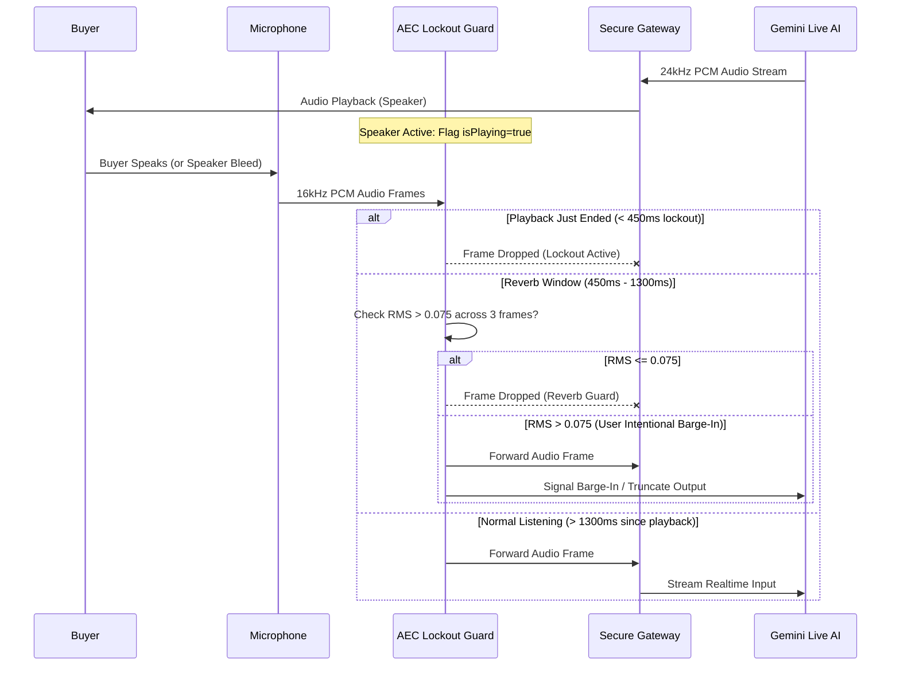

# Jessica System Architecture & Evolution Guide

## 1. Evolution: Winston -> Jarvis -> Jessica

The platform evolved across three distinct architectural phases:

```mermaid
flowchart LR
    subgraph Phase1["Phase 1: Winston AI"]
        W1["Multi-Tenant Data Layer"]
        W2["Domain Packages & Monorepo"]
        W3["PostgreSQL Isolation"]
        W4["Embeddable Widget"]
    end

    subgraph Phase2["Phase 2: Jarvis Voice"]
        J1["Gemini Live WebSocket"]
        J2["Duplex 24kHz/16kHz Audio"]
        J3["Voice Activity Detection (VAD)"]
        J4["Barge-In Handling"]
    end

    subgraph Phase3["Phase 3: Jessica Concierge"]
        K1["Secure Server Gateway Proxy (/live-gateway)"]
        K2["Two-Stage Acoustic Echo Cancellation"]
        K3["Real-Time Lead Extraction & CRM Sync"]
        K4["Production Hardening & Diagnostics HUD"]
    end

    Phase1 --> Phase2 --> Phase3
```



---

## 2. End-to-End System Architecture

```mermaid
flowchart TD
    subgraph ClientLayer["Dealership Website & Client Browser"]
        Widget["<winston-widget> / Jessica Embed"]
        WebAudioEngine["WebAudio Engine (16kHz In / 24kHz Out)"]
        VAD["Voice Activity Detector (RMS + Gate)"]
        AEC["Two-Stage Echo Cancellation Guard"]
        LiveClient["GeminiLiveClient (WebSocket)"]
    end

    subgraph ServerLayer["Node.js / Express Gateway Cluster"]
        GatewayRouter["HTTP & WS Server (server.ts)"]
        LiveGateway["/live-gateway WebSocket Proxy (voiceGateway.ts)"]
        LeadSync["Voice Lead Sync & Extractor (voiceLeadSync.ts)"]
        TenantAuth["Tenant Origin & JWT Middleware"]
    end

    subgraph CloudServices["Upstream & External Services"]
        GeminiLive["Google Gemini Live API (Native Audio)"]
        PostgresDB[("PostgreSQL Multi-Tenant DB")]
        DealerCRM["Dealership CRM (HubSpot, VinSolutions, Elead, Webhook)"]
    end

    Widget --> WebAudioEngine
    WebAudioEngine --> VAD --> AEC --> LiveClient
    LiveClient <--> |Secure WebSocket (No API Key)| LiveGateway
    LiveGateway <--> |Authenticated WSS + GEMINI_API_KEY| GeminiLive
    LiveClient --> |Lead Triggers| LeadSync
    LeadSync --> PostgresDB
    LeadSync --> DealerCRM
```

---

## 3. Audio Streaming & Echo Cancellation Details

A common issue in browser-based full duplex voice is speaker audio feeding back into the open microphone, causing the AI to hear and repeat itself.

The Jessica engine implements a dual-stage acoustic echo cancellation (AEC) pipeline:



---

## 4. Multi-Tenant Database & Isolation Model

Every database table enforces tenant isolation via the `tenant_id` foreign key:

- **`tenants`**: Dealership identifier, name, slug, domain, status, and config JSON.
- **`dealers`**: Physical rooftop dealership locations, brand franchises (e.g. Ford, Toyota, BMW).
- **`tenant_api_keys`**: Hashed API keys for widget bootstrap and REST API authentication.
- **`leads`**: Qualified customer leads extracted during voice sessions.
- **`sessions`**: Voice session metadata, duration, quality metrics, and connection latency.
- **`conversations`**: Complete timestamped turn-by-turn transcripts (user audio, agent audio, tools).
- **`vehicles`**: Real-time dealer inventory (VIN, year, make, model, trim, price, mileage, status).

### Tenant Configuration Schema (`TenantConfig`)

```typescript
interface TenantConfig {
  tenantId: string;
  dealershipName: string;
  persona: {
    name: 'Jessica' | 'Jarvis' | 'Winston';
    tone: 'warm_professional' | 'consultative' | 'direct';
    greeting: string;
    systemInstructionOverride?: string;
  };
  voice: {
    model: 'gemini-2.0-flash-exp' | 'gemini-2.5-flash-native-audio';
    voiceName: 'Puck' | 'Charon' | 'Kore' | 'Fenrir' | 'Aoede';
    temperature: number;
  };
  crm: {
    provider: 'hubspot' | 'vinsolutions' | 'elead' | 'webhook';
    webhookUrl?: string;
    apiKey?: string;
  };
  inventorySync: {
    enabled: boolean;
    feedUrl?: string;
    refreshIntervalMinutes: number;
  };
}
```
